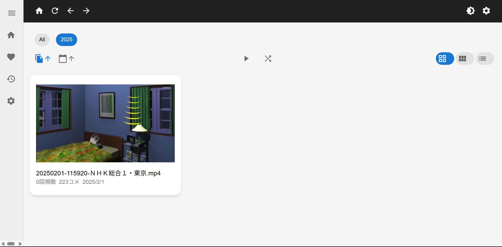
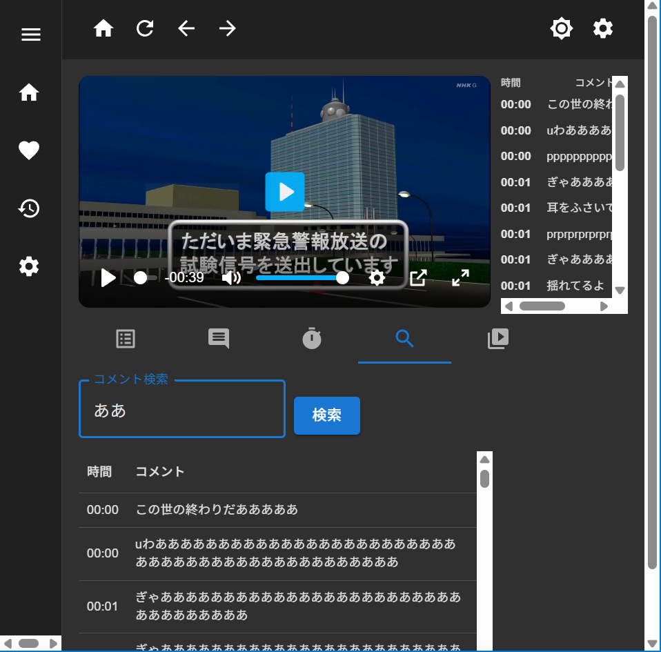
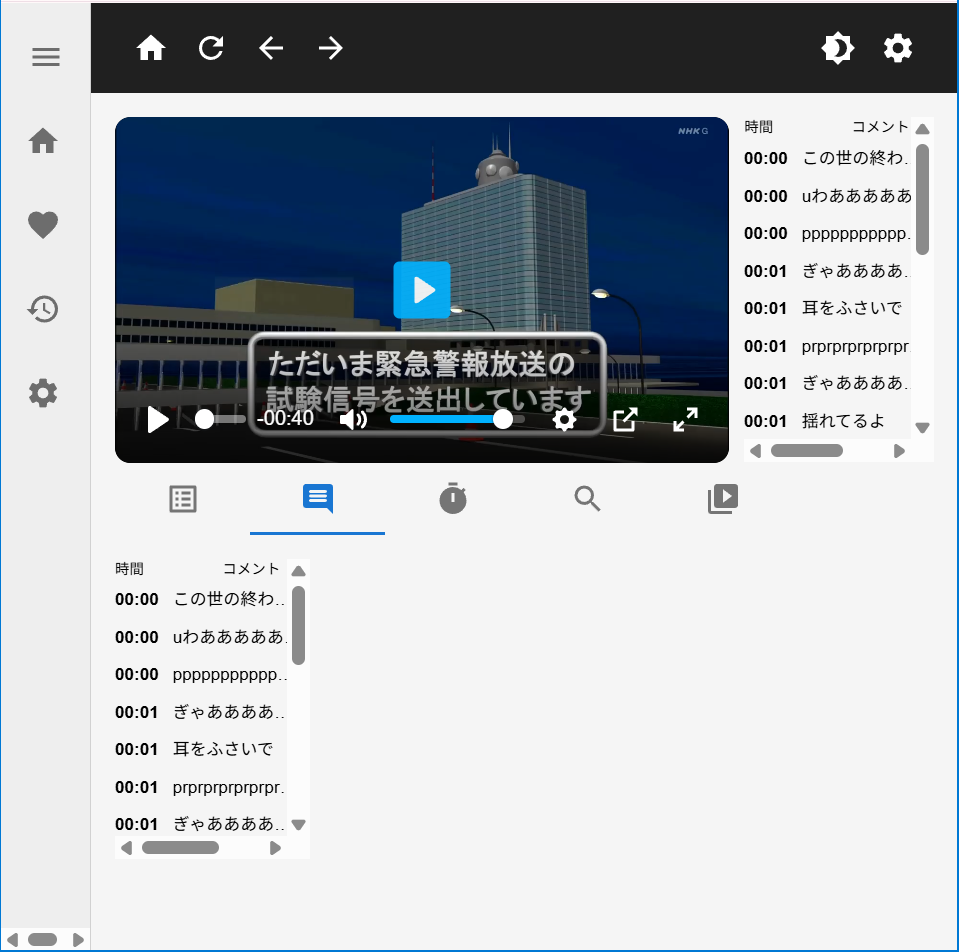
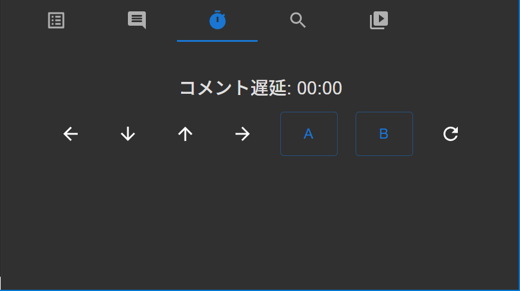
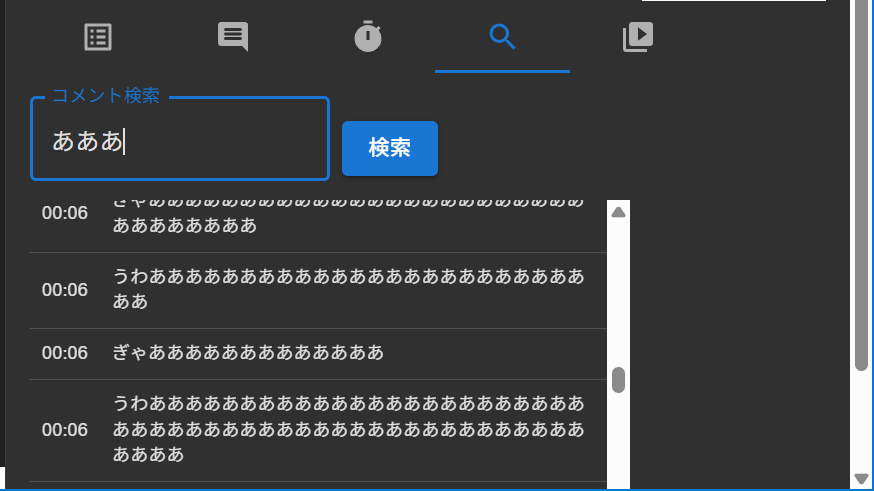
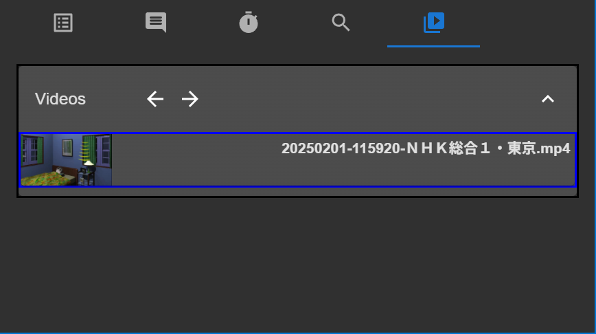
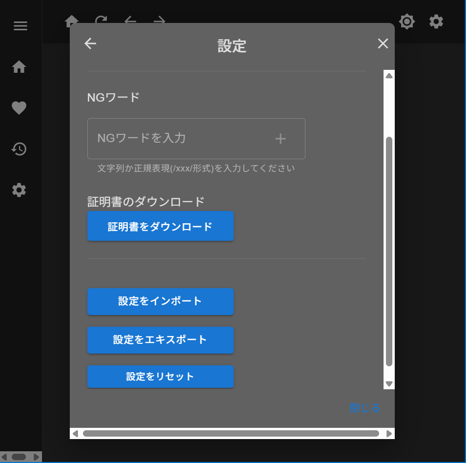
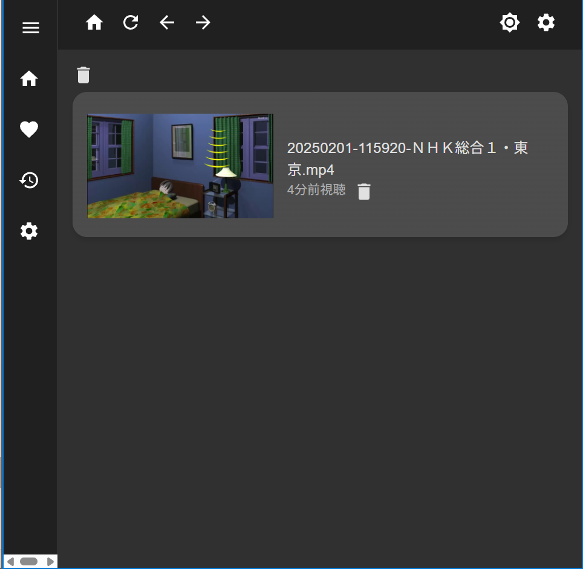

# video_app

PC に保存してある mp4 ファイルをと同じフォルダ内にあるニコニコ動画の xml ファイルをコメント付きで再生できるブラウザベースのアプリです。mp4 再生だけでなく、HLS に変換しての再生も可能です。

現時点では YoutubeLive のようにコメントテーブル形式でしかコメントを表示できませんが、将来的には弾幕形式で表示したり、YoutubeLive のコメントにも対応させたいと考えています。


<br/>


### 目次

- [設計思想](#設計思想)
- [動作環境](#動作環境)
- [インストール手順](#インストール手順)
- [機能](#機能)
- [FAQ](#faq)

### 設計思想

PC に保存してある動画を見る場合、多くの人が PC で VLC などのアプリを使って視聴しているかと思います。しかし、ほとんどのソフトウェアはブラウザ視聴に対応しておらず、外出先でスマホなどで視聴することは難しいかと思います。

そこで、ブラウザベースでコメントも表示でき、HLS を使って動画を低遅延で再生できる動画アプリを開発してみました。

### 動作環境

手元環境ではサーバー側は Windows(10、11)、クライアント側は IOS Safari(PWA 含む)と Windows Chrome で動作確認しました。MacOS、Linux、Android 環境では動作検証できておりません。

### インストール手順

将来的にはインストーラを使って対話的にインストールできるようにしたいですが、pkg を使ったバイナリ化がうまくいかなかったので一時保留にしてます。~~コードは installer フォルダ下に存在します~~。
<br/>
以下は開発版のインストール手順です。安定動作はしない可能性があるので、リリース版を出来れば利用してください。
<br/>

#### 初回起動時

1. Node.js と npm がインストールされていることを確認

   ```bash
   node -v
   npm -v
   ```

   バージョンが表示されない場合は[Node.js 公式サイト](https://nodejs.org/ja/download) あるいは OS ごとのパッケージマネージャーでインストールしてください。
   </br>

2. このリポジトリをクローン

   ```bash
   git clone <URL>
   ```

   その後はルートフォルダにある installer.ps1 を PowerShell で実行すればインストールが完了します。コマンドで実行する場合は以下のような流れになります。

3. PM2 をグローバルインストール

   ```bash
   npm -g install pm2
   ```

4. ダウンロードしたフォルダのバックエンドディレクトリに移動

   ```bash
   cd (repository_directory)/backend
   ```

5. 必要な依存関係をインストール

   ```bash
   npm install
   ```

6. sqlite マイグレーションの実行

   ```bash
   npm run migrate-dev
   ```

7. TypeScript のコンパイル

   ```bash
   npx tsc
   ```

8. `config.ini` の置き換え

   このアプリはルートフォルダにある ini ファイルに指定した複数のフォルダ内の mp4 ファイルと、それと同じ名前のニコニコ動画の xml ファイルを読み込みます。コメントファイルのサンプルは`/backend/assets/sample_videos`以下に存在します。
   <br/>
   ini ファイルでは同じ変数を複数認識することはできないので、複数のフォルダを読み込みたい場合は、`paths1`や`paths2`のように`paths`の後に適当な文字を追加してください。
   <br/>

   また、`hls_mode=true`の記述があると、HLS モードで起動します。

   ```ini
   [folders]
   paths=/path/to/video/folder1
   paths1=/path/to/video/folder2

   [settings]
   hls_mode=true
   ```

   > パスにクオートを含めないでください。

   > 改行が入っていると二つ目以降を読み取れません。

9. PM2 でアプリケーションを起動

   ```bash
   pm2 start dist/app.js
   ```

10. アプリが起動していることを確認

    ```bash
    pm2 status
    ```

11. ブラウザでアクセス

    ブラウザで `http://(IP アドレス):3002` にアクセスすることでアプリが使えます。HTTPS を使う場合のポート番号は 3100 です。

#### それ以降

`start_app.bat`をダブルクリックして起動できます。DB 履歴を初期化したい場合は`update_db.bat`をダブルクリックします。

#### Tailescale の導入

このアプリを外出先から視聴するには、[Tailescale](https://tailscale.com/)などの VPN ソフトを使う必要があります。Tailescale から与えられた IP アドレスを使ってアクセスしてください。

> [!NOTE]  
> 同じネットワーク環境(自宅のスマホなど)から視聴する場合は PC の IP アドレスを指定するのみで、VPN ソフトは必要ありません。

> [!NOTE]  
> PC 版の場合は証明書エラーを出さないために、`localhost`あるいは`127.0.0.1`をホスト名に指定してください。

#### スマホアプリとして使う

ブラウザでこのサイトを開き、[ホーム画面に追加]や[アプリをインストール]を押すことで PWA 形式のスマホアプリとして使えます。

> serviceWorker のコード自体は存在しますが、HTTPS 化しないと効果はありません。

> openssl での自己署名証明書になりますが、設定ページから証明書をダウンロードすることで HTTPS 対応できます。証明書のデバイスへの設定手順は各 OS ごとに異なります。

</br>

### 機能

主要機能を列挙します。

**起動時**

- 指定したフォルダ内の mp4 から HLS ファイルを作成
- サムネ画像生成
- コメント数やその他のメタデータを DB(sqlite)に保存

**一覧画面**

- ダークモード切替(デフォルトはデバイスの状態で、上書き出来ます)
- アイコンの大きさを 3 種類に切り替えて表示
- 動画ファイル名、動画の作成日時、コメント数で昇順、降順での並び替え
- 動画の年代ごとに動画をフィルタリングして表示
- シャッフル再生
- 視聴回数を表示

**再生画面**

- 連続再生、プレイリスト再生
- コメントテーブル表示
- コメント遅延秒数変更

  - A、B、C でそれに対応するコメント位置にシークできます。
  - 5 秒か 1 分単位でコメント遅延を調整できます。

- コメント検索機能
- 倍速再生、音量切り替えなど一般的な機能
- キーボードショートカット

> [!NOTE]  
> このアプリは内部的に `plyr` という動画ライブラリを使っているのでショートカットは[こちら](https://github.com/sampotts/plyr#shortcuts)から確認できます。

> [!NOTE]  
> スマホ版は画面の左側、中央、右側のダブルタップでそれぞれ 10 秒前、再生停止切り替え、10 秒送りできます。

また、スマホ版では画面右にコメントテーブルは表示されず、画面下のタブでコメントを表示できます。

> [!NOTE]  
> コメントファイルがない動画もコメントテーブルは表示されません。

</br>


また、下にあるタブでは動画メタデータ、コメントテーブル、コメント遅延秒数切替、コメント検索、プレイリストのいづれかを選択して表示できます。

デフォルトでは動画が終了すると次の動画が自動で再生されますが、プレイリスト内の動画をクリックすることでその動画を再生できます。




**設定画面**

- コメント NG 機能(通常の単語と正規表現の両方に対応)
- コメントのフォント切り替え
- 自己署名証明書を作成し、ダウンロードする機能
- 設定を json 形式でインポート、エキスポート、リセット


**視聴履歴画面**

- 視聴履歴を新しい順に表示
- 単一、あるいは全ての視聴履歴を削除


### FAQ

#### 動画追加時に PC が長時間重くなる

HLS モードで起動する場合、ffmpeg を使って mp4 から HLS ファイルを生成するため、PC のスペックによっては CPU 使用率が 100%近くになってしまう可能性があります。

> 今後はマルチスレッドを使って上記の CPU 集約型処理を並列化する処理に変更し、負荷を軽減したいです。

#### アプリが容量をとる

HLS モードを使って起動する場合、mp4 だけでなく、HLS ファイルまで作成しているため、単純計算で 2 倍の容量をとってしまいます。

#### 動画が表示されない

現在 mp4 の動画にのみ対応しています。~~他の形式に対応させることは簡単ですが、自分自身 mp4 しか使わないのでこの実装は後回しにします。~~

#### コメントが表示されない

同じフォルダ内に、mp4 とニコニコ動画の xml 形式のコメントファイルが同じ名前で存在することをご確認ください。

> 例: sample.mp4 なら sample.xml

#### サムネが表示されない

現在の実装では 10 秒未満の動画ではスクショは生成されません。
</br>

**追記**

内部動作に関しては`/docs`以下のREADMEをご覧ください。
