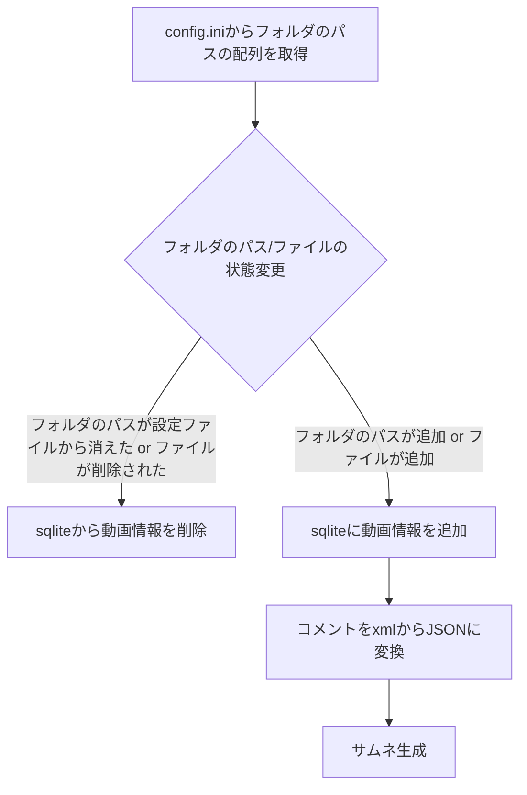
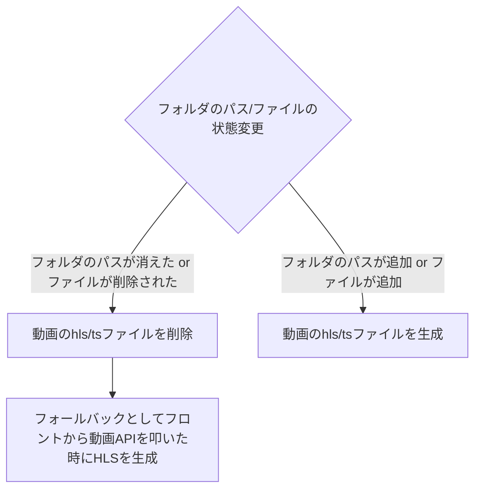

# このアプリの仕様

簡単に動作フローやフォルダ構造について書きます。開発記事に関しては[こちら](https://hoge-code.github.io/md/posts/2025-02-21-video-app)も参照ください。

### 起動直後の流れ



**HLSモードの場合**

HLSモードの場合は以下のフローが追加されます。


### バックエンドの構造

```plaintext
|--assets
|  |--screenshots # サムネ生成後の保存先
|  |--stream # HLSファイルの保存先
|--src
|  |--constants # フォルダパスの定数
|  |--installer # 対話型インストーラ
|  |--logs # カスタムロガーとログファイルの保存先
|  |--middleware # カスタムミドルウェア
|  |--prisma # ORM
|  |--repositories # prismaのクエリ
|  |--routers # ルーター
|  |--services # サービスファイル
|  |--utils # ユーティリティ関数
```

### フロントの構造

```plaintext
|--public # PWA用のファイル
|  |--assets # PWA用の様々な大きさの画像
|--src
|  |--assets 
|  |--components # 再利用用のコンポーネント
|  |--context # 永続化用のuseContext
|  |--hooks # カスタムフック
|  |--pages # ページ(テンプレートを利用)
|  |--styles # フォントインストール用のcss
|  |--types # 全体で利用する型
|  |--utils # ユーティリティ関数
```


